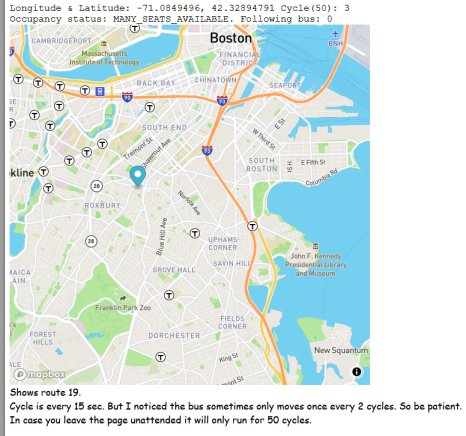

## Real Time Bus Tracker

### Boston Route 19

Displays the location of one bus on the route 19 in Boston. Makes use of MapBox.

Cycle (update time) is every 15 sec. But I noticed the bus sometimes only moves once every 2 cycles. So be patient.

In case you leave the page unattended it will only run for 50 cycles to reduce requests.

There seems to be no service afterhours, so it will only work during the day (Eastern Time).

### Extra

Added seat availability, Latitude & Longitude info above the map.

### Important

If the **occupancy status** reports null, the bus is probably not running. You would have to wait some time until the bus runs again.
Added some code to look between bus[0] and bus[10] for the first active bus.

### License information
Most code obtained from MIT. Adjustments and additions by Ramon C

